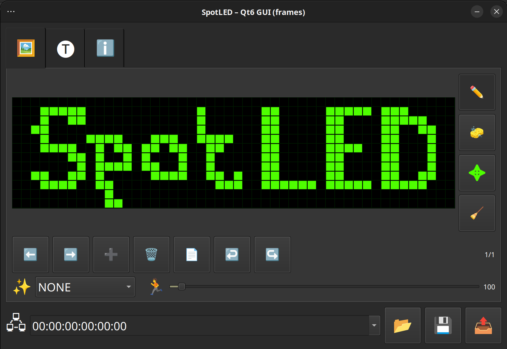

# SpotLED GUI



Animation editor for Chinese SpotLED displays. The app lets you create and preview frame‑based LED animations before sending them to SpotLED hardware via BLE.

## Disclaimer
Notice! This library is not affilated with the creator of this product.

## Features
- Pixel editor with drawing, erasing, clearing, and whole-frame shifting tools.
- Frame timeline with add/remove, previous/next navigation, and copy-from-previous shortcuts.
- Undo/redo history per frame for quick corrections.
- PNG monochrome image importing.
- Animation options for built-in SpotLED effects and playback speed.
- Text mode with optional two-line display and effect controls.
- Custom fonts can be placed in fonts folder.
- Project save/load to JSON files plus direct BLE upload to SpotLED devices.
- And more…

## Technology
- Python 3
- [PySide6](https://doc.qt.io/qtforpython/) for the Qt-based GUI
- [python-spotled](https://github.com/iwalton3/python-spotled) for communicating with SpotLED hardware

## Quick start

Get the release package https://github.com/ordigital/spotled-gui/releases/download/v1.0/SpotLED-1.0-x86_64_AppImage.zip and run `SpotLED-GUI-x86_64.AppImage`

## Installation (from source tree)

```bash
git clone https://github.com/ordigital/spotled-gui.git
cd spotled-gui

# install deps
sudo apt install pkg-config libglib2.0-dev \
    libboost-python-dev python3-gattlib libbluetooth-dev \
    bluez build-essential python3.12-dev \
    libboost-thread-dev libboost-python-dev \
    libglib2.0-dev libbluetooth-dev pkg-config \
    libxcb-cursor0

# create and activate a virtual environment:
python -m venv venv
source venv/bin/activate 
pip install PySide6 spotled

# or use script for Ubuntu 24.04:
chmod +x ./install.sh
sudo ./install.sh
```

Text speed fix: https://github.com/iwalton3/python-spotled/pull/10/commits/24e319ed55382857c710baf32f2b19d71fbb8ea4

## Running

```bash
python spotled_gui.py

# or just:
chmod +x ./spotled
./spotled
```

The GUI opens immediately. Make sure your SpotLED device is powered on and reachable over BLE before using the send functionality.
